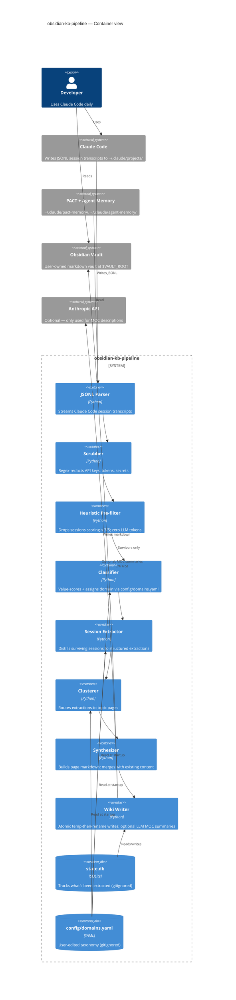

# obsidian-kb-pipeline

Andrej Karpathy's [LLM Wiki gist](https://gist.github.com/karpathy/442a6bf555914893e9891c11519de94f) outlined the idea that AI work should feed back into itself — knowledge as a persistent compounding artifact, not a chat history. `obsidian-kb-pipeline` is that pattern, pointed specifically at Claude Code sessions and agent memory. A local pipeline runs in the background, distills durable knowledge out of every Claude Code session, and writes it as organized markdown into your Obsidian vault. The more you use Claude Code, the sharper every future session gets.

The loop:

- AI work generates knowledge.
- That knowledge feeds back into your global Claude config.
- Every future agent consults the wiki before working.
- The more you use Claude Code, the sharper every future session gets. It actually compounds.

## What it does

The pipeline reads Claude Code JSONL session transcripts from `~/.claude/projects/`, PACT memory from `~/.claude/pact-memory/`, and agent memory from `~/.claude/agent-memory/`. It scrubs credentials, applies a heuristic value-score filter, extracts what survives into structured findings, clusters them by topic, and writes organized markdown pages into your Obsidian vault. State lives in a local SQLite cache (`state.db`) so subsequent runs are incremental — sessions and memory entries that have already been processed are skipped.

## Architecture



## How the heuristic pre-filter works

The pre-filter runs BEFORE any LLM call. It drops low-signal sessions on cheap features: message count, text volume, decision/architecture/gotcha keyword density, and project-path domain hints. Sessions scoring below 3 on a 1-5 value scale are dropped wholesale — zero LLM tokens spent on them.

Worked examples:

- A 4-message exploratory session asking about TypeScript syntax → score 1, dropped.
- A 35-message debug session that named a workaround and a gotcha in the project-path domain you care about → score 4, kept and routed to extraction.

See `src/prefilter.py` for the scoring heuristic and `src/classifier.py` for the domain inference + per-session value classification. Both are pure-Python and take no external dependencies. The value-score threshold is `SessionConfig.min_value_score` in `src/config.py` (default 3).

The taxonomy that drives the project-path domain hint is YAML-defined in `config/domains.yaml` — copy `config/domains.example.yaml` and edit. Adjusting which substrings map to which domain labels takes effect on the next run; no code change required.

## How the scrubber works

Before the pre-filter sees content, the scrubber runs a regex pass that redacts credentials: Anthropic API keys (`sk-ant-…`), OAuth tokens, AWS access keys, generic bearer tokens, and known secret-prefix patterns. The scrubbed text is what enters the rest of the pipeline, so credentials cannot leak into your wiki pages even if they appeared in a session transcript.

Two caveats: redaction is regex-based, not semantic — a token-shaped string that does not match a known pattern will pass through. Review wiki output before sharing publicly. And the scrubber runs in-memory only; the source JSONL files in `~/.claude/projects/` are not modified.

See `src/scrubber.py` for the regex set.

## Requirements

- macOS for the built-in launchd scheduling. Linux users wire up their own scheduler; the pipeline core is platform-agnostic.
- Python 3.11 or newer.
- An Obsidian vault (or any directory; the pipeline writes plain markdown with YAML frontmatter).
- Optional: an Anthropic API key for LLM-generated MOC entry summaries.

## Install

```bash
git clone git@github.com:v4lheru/obsidian-kb-pipeline.git
cd obsidian-kb-pipeline
python3 -m venv .venv
source .venv/bin/activate
pip install -e .                # core
pip install -e ".[llm]"         # also installs anthropic for MOC descriptions
cp .env.example .env
cp config/domains.example.yaml config/domains.yaml
```

Edit `.env` and set `VAULT_ROOT` to the absolute path of your Obsidian vault. Edit `config/domains.yaml` if you want custom project domain routing — leave it alone for a first run.

First run:

```bash
# Equivalent invocations after `pip install -e .`:
obsidian-kb-pipeline run --sources all
python -m src.pipeline run --sources all
```

`--sources` accepts `memory-only` (Phase 1: pact-memory + agent-memory + project-memory only), `sessions` (Phase 2: Claude Code JSONL transcripts only), or `all`. The default is `memory-only`. Add `--project "MyProject"` to scope a sessions run to a single Claude Code project directory. Add `--dry-run` to classify sessions and print per-score statistics without writing to the vault.

For scheduled background runs, see [INSTALL.md](INSTALL.md).

## Configuration

The pipeline reads two sources of configuration:

| Where | What |
|---|---|
| `.env` | Machine-level paths and credentials: `VAULT_ROOT`, `VAULT_NOTES_SUBPATH`, optional `ANTHROPIC_API_KEY`, optional `KB_BRAIN_DOMAINS_FILE` override, optional `KB_BRAIN_LOG_LEVEL`. See `.env.example` for the full set. |
| `config/domains.yaml` | Per-user taxonomy: project domain patterns, topic canonicalization, wiki page routing, path components to strip when humanizing project directory names. See `config/domains.example.yaml` for the schema with worked examples. |

Both files are gitignored. Only the `.example` versions are tracked. Missing `config/domains.yaml` is not an error — the pipeline silently falls back to built-in defaults and logs a single INFO line.

## How it works

The pipeline runs in eight stages, each implemented as a single module in `src/`:

1. **Parse** (`src/jsonl_parser.py`): streams JSONL session files line-by-line; yields per-message structured records. Tolerates malformed lines.
2. **Scrub** (`src/scrubber.py`): regex redaction of credentials, run on every message before downstream code sees it.
3. **Pre-filter** (`src/prefilter.py`): cheap value-score heuristic that decides which sessions are worth distilling.
4. **Classify** (`src/classifier.py`): assigns a domain label and finalizes the value score for surviving sessions.
5. **Extract** (`src/session_extractor.py`): distills the scrubbed transcript into structured findings (decisions, gotchas, patterns).
6. **Cluster** (`src/clusterer.py`): routes findings to topic pages based on `config/domains.yaml` and the built-in topic map.
7. **Synthesize** (`src/synthesizer.py`): builds page markdown, merges with existing content, populates `[[wikilinks]]`.
8. **Write** (`src/wiki_writer.py`): atomic temp-then-rename writes into the vault. Optionally calls the Anthropic API to generate MOC entry summaries when `ANTHROPIC_API_KEY` is set.

State for incremental runs lives in `state.db` (SQLite) managed by `src/state_store.py`. Pages exceeding `SynthesisConfig.max_page_words` (default 3000) are not appended to; new findings are deferred to a subsequent quality-check report (`src/quality_check.py`).

## Example output

A page the pipeline might produce for the topic "typescript strict-null patterns":

```markdown
---
type: resource
tags: [wiki, pattern, typescript]
status: reference
wiki-source: auto
wiki-confidence: medium
created: 2026-02-12
modified: 2026-04-30
---

# TypeScript Strict-Null Patterns

## Overview
Patterns extracted from Claude Code debugging sessions for the
TypeScript strict-null-checks compiler flag.

## Pattern 1 — Discriminated unions for nullable returns
When a function may return null, prefer a discriminated-union result
shape over a `T | null` return. Forces callers to branch.

```ts
type Result<T> = { ok: true; value: T } | { ok: false; error: string };


## Pattern 2 — `satisfies` over `as`
For const objects, `satisfies` preserves narrowing where `as` erases it.

## Related
- [[arch-react-strict-mode]]
- [[gotcha-typescript-types-vs-interfaces]]
```

The structure follows the wiki page schema in [wiki-schema.md](wiki-schema.md).

## Testing

```bash
python -m unittest discover
```

Tests cover: scrubber regex, JSONL parsing, memory readers, idempotency (re-running a session does not duplicate content), atomic wiki writes, frontmatter handling, and wikilink validity. No tests require an Anthropic API key, a real Obsidian vault, or a pre-existing `state.db` — `python -m unittest discover` runs green from a fresh clone.

## Roadmap / known limitations

This pipeline writes autonomously and keeps extractions forever. Known gaps:

- **No drift detection.** When a topic page accumulates extractions, the synthesizer merges them but does not detect when new content contradicts old. A future LLM-based "is this consistent?" check is on the list.
- **No human-gating.** The pipeline writes directly to your vault. A `--dry-run` mode that emits a diff for review before write is a planned addition.
- **No rot pruning.** Old extractions remain in pages indefinitely. Page size is bounded by `SynthesisConfig.max_page_words` (currently 3000) but stale content is not aged out.
- **Semantic deduplication is shallow.** The pipeline deduplicates on exact-text match. Paraphrased duplicates survive. An embedding-based pass is a candidate addition.
- **macOS-only scheduling.** `launchd` is the only built-in scheduler. Linux users wire up `systemd-timer` or `cron`; the pipeline core is platform-agnostic.

Issues and PRs welcome.

## Credits

The compounding-knowledge framing comes from Andrej Karpathy's [LLM Wiki gist](https://gist.github.com/karpathy/442a6bf555914893e9891c11519de94f). This repo is one concrete implementation of that pattern.

## License

MIT. See [LICENSE](LICENSE).
